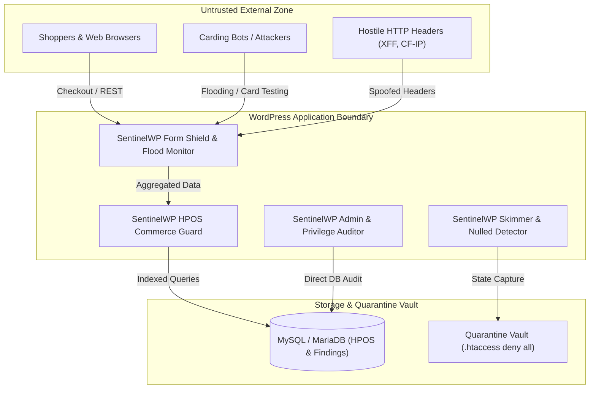

# SentinelWP Security — Threat Model & Security Specification

This document defines the security boundaries, threat vectors, explicit assumptions, and defensive scope of SentinelWP Security.

---

## 1. System Overview & Core Mission

SentinelWP is an application-layer WordPress and WooCommerce security plugin. Its primary objective is to protect **store revenue, checkout funnel integrity, and customer payment data** without disrupting legitimate customer transactions or creating destructive remediation risks.

---

## 2. Security Boundaries & Trust Zones

---

## 3. What SentinelWP Protects Against

### A. Magecart & Payment Form Harvesters
- **Threat Vector**: Injected JavaScript listening to payment fields (`card`, `cc-num`, `cvv`, `expir`) and exfiltrating data to untrusted external endpoints via `fetch`, `sendBeacon`, `XMLHttpRequest`, or `new Image().src`.
- **Defense Mechanism**: Content and AST-level pattern matching across all frontend `.js` assets, media uploads, and `wp_options` injections.

### B. Card Testing & Payment Gateway Abuse
- **Threat Vector**: Automated botnets executing rapid low-value transactions with stolen card lists to identify valid card numbers, generating substantial gateway decline fees and chargebacks.
- **Defense Mechanism**: Real-time IP/email velocity tracking and failed-payment burst detection combined with HPOS-optimized database aggregations.

### C. Stealth Administrators & Role Escalation Backdoors
- **Threat Vector**: Backdoors or malicious plugins silently granting administrator capabilities via direct database updates or hiding user records using WordPress user query filters.
- **Defense Mechanism**: Direct low-level SQL audits against `wp_users` and `wp_usermeta` cross-referencing capabilities against registered user roles.

### D. Nulled / Pirated Plugins & Distribution Backdoors
- **Threat Vector**: GPL-pirated themes/plugins containing license bypass shims, suppressed update notifications, and hidden phone-home C2 domains.
- **Defense Mechanism**: Malicious file inventory matching, license validation bypass pattern detection, update transient filter auditing, and decoded base64 domain cross-referencing.

### E. Destructive Remediation & False Positive Damage
- **Threat Vector**: Security plugins deleting critical site files or theme assets due to heuristic false alarms.
- **Defense Mechanism**: Two-phase atomic quarantine vault with SHA-256 state capture and 1-click exact rollback preserving original filesystem permissions (`0644`).

---

## 4. What SentinelWP Does Not Guarantee (Explicit Non-Goals)

To maintain realistic security guarantees, SentinelWP explicitly acknowledges the following operational boundaries:

1. **Kernel / OS-Level Compromise**: If an attacker gains root or system-level access to the underlying server (e.g., via SSH or hosting control panel), application-layer WordPress plugins cannot guarantee defense or integrity.
2. **Database Superuser Hijacking**: If an attacker executes arbitrary SQL queries directly via the MySQL root account bypassing WordPress, local database hashes and logs can be manipulated.
3. **Hardware & Hypervisor Security**: SentinelWP operates within the PHP runtime and assumes the integrity of the PHP interpreter and underlying operating system.
4. **Zero-Day Binary Exploits**: SentinelWP inspects PHP, JS, and image payloads; it does not perform binary decompilation of compiled server-level C/Go modules or web server binaries (e.g., Nginx, Apache).
5. **L3/L4 Network DDoS Mitigation**: Application-layer (L7) rate detection is provided, but high-volume volumetric network floods (Gbps/Tbps) must be mitigated at the edge CDN / DNS layer (e.g., Cloudflare, AWS Shield).

---

## 5. Security Invariants

SentinelWP enforces the following strict invariants throughout its codebase:

1. **Non-Destructive Posture**: No file is permanently deleted without human confirmation; all quarantines are fully reversible.
2. **Durable Two-Phase Quarantine**: A source file is never unlinked from webroot until the vault artifact checksum is verified and database metadata is committed.
3. **Strict Path Containment**: All file operations are strictly confined within `ABSPATH` and `WP_CONTENT_DIR`; symlinks escaping webroot and path traversals (`../`) are unconditionally blocked.
4. **Protected Core Immutability**: Core WordPress bootstrap files (`wp-config.php`, `index.php`, `.htaccess`, `wp-admin/*`, `wp-includes/*`) can never be quarantined or deleted by the plugin.
5. **Fail-Safe Operation**: Fail closed on security validations (rejecting unverified proxy headers), but fail gracefully on operational errors (preventing database timeouts from crashing frontend checkouts).
